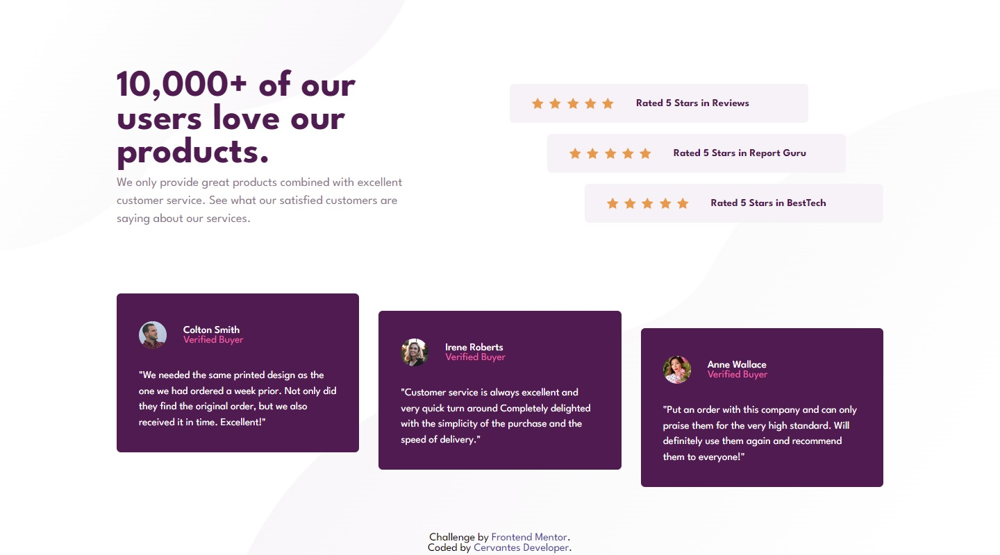

# Frontend Mentor - Social proof section solution

This is a solution to the [Social proof section challenge on Frontend Mentor](https://www.frontendmentor.io/challenges/social-proof-section-6e0qTv_bA). Frontend Mentor challenges help you improve your coding skills by building realistic projects. 

## Table of contents

- [Overview](#overview)
  - [The challenge](#the-challenge)
  - [Screenshot](#screenshot)
  - [Links](#links)
- [My process](#my-process)
  - [Built with](#built-with)
  - [What I learned](#what-i-learned)
  - [Continued development](#continued-development)
  - [Useful resources](#useful-resources)
- [Author](#author)

## Overview

### The challenge

Users should be able to:

- View the optimal layout for the section depending on their device's screen size

### Screenshot

###Links

- Solution URL: [Add solution URL here](https://github.com/cervantesdeveloper/fem_08)
- Live Site URL: [Add live site URL here](https://fem-08.netlify.app/)

## My process

### Built with

- CSS custom properties
- Flexbox
- CSS Grid
- Mobile-first workflow

### What I learned

I started to use CSS grid.

### Continued development

I'll study more about CSS grid.

### Useful resources

- [Example resource 1](https://developer.mozilla.org/es/docs/Web/CSS/CSS_Grid_Layout) - This helped me for understan a little more about CSS grid.

## Author

- Frontend Mentor - [@cervantesdeveloper](https://www.frontendmentor.io/profile/cervantesdeveloper)
- GitHub - [cervantesdeveloper](https://github.com/cervantesdeveloper)

